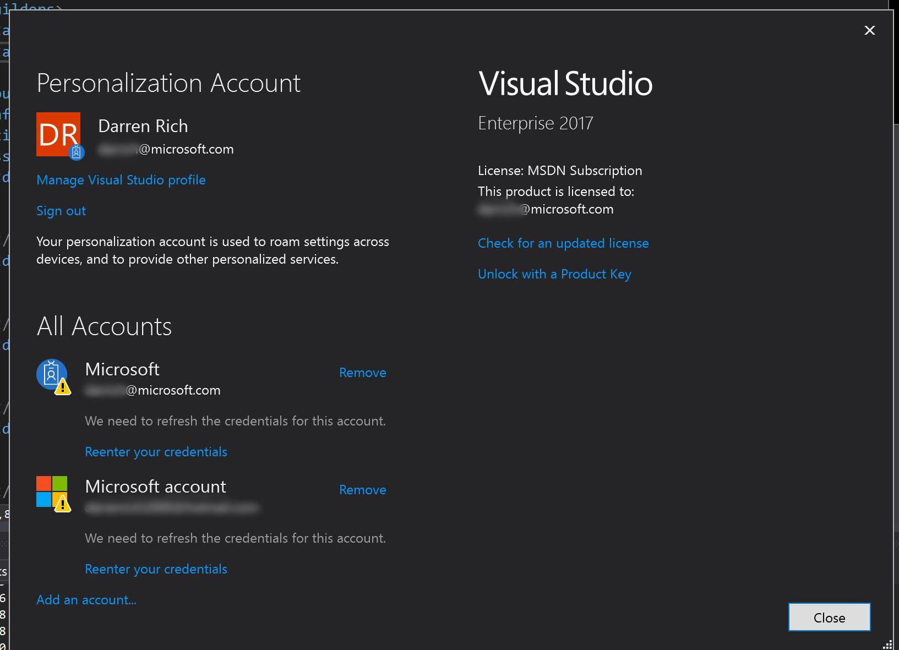

# Securing Settings 
Keeping things secure is always important but when you are working on an ERP solution which controls all of an organization's funds they tend to be a little more focused on security. :)

For this project I used .net Configuration Builds which you can read more about at [Configuration Builders](https://github.com/aspnet/MicrosoftConfigurationBuilders/blob/master/README.md)

## [UserSecretsConfigBuilder](https://github.com/aspnet/MicrosoftConfigurationBuilders/blob/master/README.md#usersecretsconfigbuilder) Notes 

- This is an XML based configuration builder
- Very important to use the %APPDATA% environment variable when creating your Secrets.XML File
  - In my testing I had assumed the path would be c:\users\NOTMYUSERNAME\appdata\\**local**\\Microsoft\UserSecrets\<userSecretsId guid>\secrets.xml
  - If I had just typed %APPDATA% in file explorer I would have found out that it's actuall ...  local\\**roaming**\\ ...

## [AzureKeyVaultConfigBuilder](https://github.com/aspnet/MicrosoftConfigurationBuilders/blob/master/README.md#azurekeyvaultconfigbuilder) Notes

- This is probably obvious but if you have your project in a public GitHub make sure that you remove the name of your keyvault from the config before checking in
- This is the only configbuilder that can be shared across teams.
- Make sure you name your keyvault secrets correctly

# Q&A

| Error Message | Resolution | Config Builder |
| --- | --- | --- |
|AzureServiceTokenProvider.\<GetAccessTokenAsyncImpl\>|You may need to reauthenticate your AAD account | Azure Key Vault|
|An error occurred while parsing EntityName |If your configuration setting also happens to include an [XML Reserved Character](https://www.w3resource.com/xml/reserved-markup-characters.php) you will need to 'escape' it with the appropriate setting. If your Azure Secret included a '\&' you need to replace it with '\&amp;'   |XML Configurator|