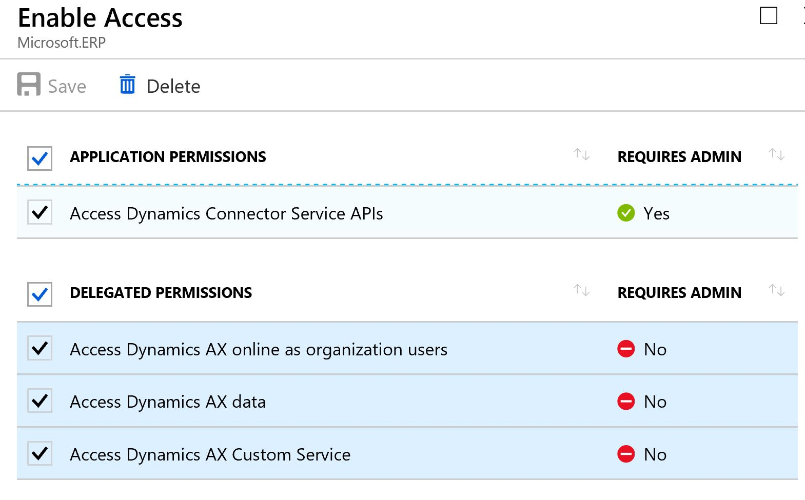

# Introduction 
This is an example project using BDD based on SpecFlow to validate the configurations of a given Dynamics 365 Finance and Operations deployment.

It relies on a cloud hosted FinOps instance and utilizing an AAD registered application.

# Dependencies
- [SpecFlow Visual Studio Extension](https://marketplace.visualstudio.com/items?itemName=TechTalkSpecFlowTeam.SpecFlowforVisualStudio2017)
 
# Getting Started

The very first thing you need is a running instance of Dynamics 365 Finance and Operations (FinOps).  It is beyond the scope of this readme to cover how to acquire an instance.
See: [FinOps Cloud Instance](https://docs.microsoft.com/en-us/dynamics365/unified-operations/dev-itpro/deployment/cloud-deployment-overview)

Summary of next steps:
- [Register an AAD "Web App / API"](https://docs.microsoft.com/en-us/dynamics365/unified-operations/dev-itpro/data-entities/services-home-page#register-a-native-application-with-aad)
- Register the [external application in FinOps](https://docs.microsoft.com/en-us/dynamics365/unified-operations/dev-itpro/data-entities/services-home-page#register-your-external-application-in-finance-and-operations)
- [Create an Azure Keyvault](https://docs.microsoft.com/en-us/azure/key-vault/key-vault-get-started)
- Collect required settings
  - axTestSecret: the AAD Key Secret
  - ActiveDirectoryTenant: URL to your tenant ID
  - ActiveDirectoryResource: this is the url to your FinOps Instance
  - ActiveDirectoryClientAppId: This is called the Application ID in Azure AD
  - YOURKEYVAULTHERE: Name of your keyvault
- Create Keyvault Secrets named axTestSecret, ActiveDirectoryTenant, ActiveDirectoryResource and ActiveDirectoryClientAppId.
- Update the app.config for the DynamicsOataTests project
  - ONLY REPLACE THE YOURKEYVAULTHERE
- Run and verify that your tests are passing

## Additional Notes on Getting Started

### When registering the "AAD Web App / API" don't forget the required permissions.

### Make sure you name your keyvault secrets correctly

# Build and Test
Download the source code, open in Visual Studio 2017 and run the tests. 

# Contribute
TBD

# References
- Awesome posting on how to combine urls at https://stackoverflow.com/questions/372865/path-combine-for-urls?rq=1 
- Data Integration with Dynamics 365 Finance and Operations https://docs.microsoft.com/en-us/dynamics365/unified-operations/dev-itpro/data-entities/integration-overview?toc=/fin-and-ops/toc.json
